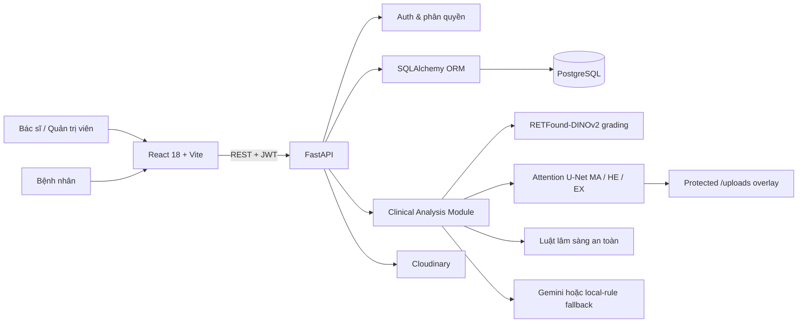

# DR-Screening

Hệ thống hỗ trợ sàng lọc bệnh võng mạc đái tháo đường (Diabetic Retinopathy - DR) từ ảnh đáy mắt. Ứng dụng kết hợp:

- quản lý hồ sơ bệnh nhân và lần khám;
- phân loại DR theo 5 mức ICDR cho từng mắt;
- phân đoạn ba nhóm tổn thương MA/HE/EX;
- luật hỗ trợ lâm sàng và bản tóm tắt hồ sơ;
- bác sĩ xác nhận hoặc điều chỉnh kết quả AI;
- lập lịch tái khám và cung cấp cổng thông tin cho bệnh nhân.

> **Giới hạn sử dụng:** Đây là hệ thống hỗ trợ sàng lọc và soạn thảo kết quả, không phải thiết bị tự chẩn đoán. Kết quả AI không thay thế khám mắt toàn diện, xét nghiệm chẩn đoán đái tháo đường hoặc kết luận của bác sĩ nhãn khoa.

## Mục lục

- [Chức năng chính](#chức-năng-chính)
- [Kiến trúc và luồng xử lý](#kiến-trúc-và-luồng-xử-lý)
- [Công nghệ sử dụng](#công-nghệ-sử-dụng)
- [Cấu trúc thư mục](#cấu-trúc-thư-mục)
- [Chuẩn bị model](#chuẩn-bị-model)
- [Cài đặt và chạy local](#cài-đặt-và-chạy-local)
- [Biến môi trường](#biến-môi-trường)
- [Tài khoản và phân quyền](#tài-khoản-và-phân-quyền)
- [API chính](#api-chính)
- [Kiểm thử và build](#kiểm-thử-và-build)
- [Huấn luyện và nghiên cứu AI](#huấn-luyện-và-nghiên-cứu-ai)
- [Docker và triển khai](#docker-và-triển-khai)
- [Trạng thái và giới hạn hiện tại](#trạng-thái-và-giới-hạn-hiện-tại)

## Chức năng chính

### Dành cho bác sĩ và quản trị viên

- Đăng nhập bằng JWT.
- Tìm kiếm, tạo, xem, cập nhật và xóa hồ sơ bệnh nhân.
- Tạo đồng thời tài khoản cổng bệnh nhân khi thêm hồ sơ mới.
- Chọn một trong hai model grading:
  - `grading`: checkpoint phân loại DR gốc;
  - `fewshot`: checkpoint ProtoNet đã thích nghi few-shot trên DeepDRiD.
- Tải ít nhất một ảnh mắt trái hoặc mắt phải, định dạng PNG/JPG/JPEG.
- Kiểm tra kỹ thuật tối thiểu, xóa EXIF/metadata và chuẩn hóa ảnh thành PNG.
- Chạy grading và segmentation song song cho từng mắt.
- Xem DR grade, độ tin cậy, phân phối xác suất, tổn thương và ảnh overlay.
- So sánh bản tóm tắt do Gemini soạn với bản tóm tắt luật cục bộ.
- Bác sĩ nhãn khoa xác nhận hoặc sửa grade riêng cho từng mắt.
- Ghi chú lâm sàng, phân tầng ưu tiên và lập lịch tái khám.
- Quét QR mã bệnh nhân.
- Xem dashboard minh chứng mô hình, lịch tái khám và tài liệu truy vết dự án.

### Dành cho bệnh nhân

- Đăng nhập bằng mã bệnh nhân.
- Xem thông tin hồ sơ, lịch sử khám và lịch tái khám.
- Chỉ xem kết quả chuyên môn sau khi lần khám có trạng thái `Reviewed`.
- Chỉ được truy cập lần khám thuộc chính hồ sơ được liên kết với tài khoản.

### Trạng thái một lần sàng lọc

```text
Upload ảnh
   │
   ▼
AI_Analyzed ── bác sĩ nhãn khoa duyệt ──► Reviewed
```

Khi mới phân tích xong, AI result đã được lưu nhưng bệnh nhân chưa nhìn thấy nội dung chuyên môn. Sau khi bác sĩ xác nhận, grade cuối cùng, ghi chú và lịch tái khám mới được mở trên cổng bệnh nhân.

## Kiến trúc và luồng xử lý

### Kiến trúc tổng thể



### Luồng tạo lần sàng lọc

1. Nhân viên chọn một bệnh nhân và tải ít nhất một ảnh fundus.
2. Backend kiểm tra MIME type, dung lượng và khả năng giải mã ảnh.
3. Ảnh được tái mã hóa thành PNG để loại bỏ metadata.
4. Quality gate kiểm tra:
   - kích thước tối thiểu `512 x 512`;
   - ảnh không quá tối hoặc quá sáng;
   - độ tương phản không quá thấp.
5. Với mỗi mắt, backend chạy song song:
   - model grading để dự đoán grade `0..4`;
   - model segmentation nếu đã bật, hoặc trả trạng thái `not_available`.
6. Module lâm sàng tổng hợp grade, độ tin cậy, tổn thương, HbA1c và thời gian mắc đái tháo đường để tạo:
   - `review_priority`;
   - khoảng theo dõi tham khảo;
   - gợi ý chuyển chuyên khoa;
   - cờ an toàn;
7. Nếu có `GEMINI_API_KEY`, Gemini soạn bản tóm tắt từ payload đã loại bỏ tên, mã bệnh nhân và thông tin liên hệ. Nếu Gemini lỗi hoặc không được cấu hình, hệ thống dùng tóm tắt luật cục bộ.
8. Ảnh fundus đã làm sạch được tải lên Cloudinary. Database chỉ lưu URL HTTPS.
9. Backend lưu lần khám, kết quả grading và kết quả segmentation vào PostgreSQL.
10. Bác sĩ nhãn khoa xác nhận/sửa grade, ghi chú và lịch tái khám.
11. Lần khám chuyển sang `Reviewed`; bệnh nhân có thể xem kết quả đã duyệt.

### Luồng AI grading

- Kiến trúc mặc định: `vit_large_patch14_dinov2.lvd142m` qua `timm`.
- Số lớp: 5 mức ICDR.
- Thiết bị: tự chọn CUDA nếu có, ngược lại dùng CPU.
- Model được lazy-load, thread-safe và được pre-warm khi backend khởi động.
- Registry chỉ giữ một model grading lớn trong bộ nhớ tại một thời điểm; khi đổi giữa `grading` và `fewshot`, model trước được giải phóng.
- Recipe tiền xử lý được đọc từ metadata checkpoint để khớp với quá trình huấn luyện.

| Grade | Nhãn |
| ---: | --- |
| 0 | No DR / Không thấy DR trên ảnh |
| 1 | Mild NPDR |
| 2 | Moderate NPDR |
| 3 | Severe NPDR |
| 4 | Proliferative DR |

### Luồng lesion segmentation

Ba checkpoint Attention U-Net chạy cho ba lớp:

| Mã | Tổn thương | Màu overlay |
| --- | --- | --- |
| MA | Microaneurysm - vi phình mạch | Đỏ |
| HE | Hemorrhage - xuất huyết | Cam |
| EX | Hard Exudate - xuất tiết cứng | Vàng |

Pipeline thực hiện ROI crop, chuẩn hóa màu, green-channel CLAHE, suy luận theo sliding window, hậu xử lý morphology, lọc connected components và ghép overlay về kích thước ảnh gốc.

### Luật an toàn lâm sàng

- Confidence dưới `0.70` gắn cờ `low_ai_confidence`.
- Grade 3 và 4 luôn yêu cầu bác sĩ/chuyên khoa xác nhận.
- HbA1c trên 8% chỉ là cờ vận hành, không phải điểm nguy cơ và không tự đổi điều trị.
- `review_priority` dùng để sắp hàng đợi rà soát, không phải risk score y khoa.
- Hệ thống không tự kê đơn, chỉ định laser, anti-VEGF hoặc phẫu thuật.

## Công nghệ sử dụng

| Phân hệ | Công nghệ |
| --- | --- |
| Frontend | React 18, Vite 5, React Router, Lucide React, html5-qrcode |
| Backend API | Python 3.10, FastAPI, Uvicorn, Pydantic |
| Xác thực | JWT, HTTP Bearer, bcrypt |
| Database | PostgreSQL 15, SQLAlchemy 2, psycopg2 |
| Grading | PyTorch, TorchVision, timm, RETFound-DINOv2 |
| Segmentation | PyTorch Lightning, segmentation-models-pytorch, Attention U-Net |
| Xử lý ảnh | Pillow, OpenCV, NumPy |
| Tóm tắt hồ sơ | Gemini REST API qua HTTPX, có local-rule fallback |
| Lưu ảnh | Cloudinary |
| Báo cáo | fpdf2 - mới có module dựng PDF, chưa có endpoint hoàn chỉnh |
| Web production | Nginx, Docker multi-stage build |
| Kiểm thử | pytest |

## Cấu trúc thư mục

```text
dr-diagnostic-system/
├── ai/
│   ├── grading/                 # Train/evaluate/predict DR grading
│   ├── preprocessing/           # Tiền xử lý fundus dùng chung
│   ├── segmentation/            # Mã huấn luyện Attention U-Net
│   ├── train_fewshot/           # Few-shot ProtoNet trên DeepDRiD
│   ├── train_semi_v2/           # Semi-supervised/pseudo-labeling
│   └── weights/                 # Checkpoint runtime, không commit Git
├── backend/
│   ├── app/
│   │   ├── api/                 # Auth, patients, screenings, reviews, reports
│   │   ├── clinical/            # Orchestrator, adapter AI, quality, rules, summary
│   │   ├── core/                # Config, database, JWT và phân quyền
│   │   ├── models/              # SQLAlchemy models
│   │   ├── schemas/             # Pydantic request/response schemas
│   │   └── services/            # Grading, segmentation, Cloudinary
│   ├── segmentation_lesion_v1/  # Bản module segmentation dùng cho runtime
│   ├── tests/                   # Contract/unit tests backend
│   ├── uploads/                 # Overlay sinh lúc chạy, được bảo vệ bằng JWT
│   ├── main.py                  # FastAPI entry point
│   ├── requirements.txt
│   └── Dockerfile
├── frontend/
│   ├── src/
│   │   ├── components/          # Portal, modal, review, QR, evidence
│   │   ├── services/api.js      # REST client
│   │   ├── theme/               # Màu dùng tập trung
│   │   ├── App.jsx              # Luồng UI chính
│   │   └── main.jsx
│   ├── nginx.conf
│   ├── package.json
│   └── Dockerfile
├── docs/                        # API, guideline, traceability và nghiên cứu
├── CONTEXT.md                   # Thuật ngữ miền nghiệp vụ
├── docker-compose.yml
└── README.md
```

## Chuẩn bị model

Các checkpoint rất lớn và bị loại khỏi Git bằng `.gitignore`. Một bản clone mới phải tự tải hoặc sao chép model vào đúng vị trí.

```text
ai/weights/
├── grading/
│   ├── checkpoint-best.pth
│   └── best-fewshot.pth
└── segmentation/
    ├── idrid_MA/
    │   └── best-checkpoint-epoch=17-val_dice=0.0305.ckpt
    ├── idrid_HE/
    │   └── best-checkpoint-epoch=70-val_dice=0.0272.ckpt
    └── idrid_EX/
        └── best-checkpoint-epoch=64-val_dice=0.0414.ckpt
```

Tổng dung lượng bộ checkpoint hiện tại khoảng 3.3 GB. Cần thêm bộ nhớ cho model sau khi nạp vào RAM/VRAM.

Có thể chạy grading mà không bật segmentation:

```env
AI_GRADING_SERVICE_URL=local
AI_SEGMENTATION_SERVICE_URL=disabled
```

Trong chế độ này, kết quả segmentation có `status=not_available`; hệ thống không được diễn giải thành “không có tổn thương”.

## Cài đặt và chạy local

### 1. Yêu cầu

- Python 3.10 được khuyến nghị.
- Node.js 18+ và npm.
- PostgreSQL 15.
- Cloudinary account nếu cần chạy luồng upload hoàn chỉnh.
- Docker Desktop là tùy chọn để chỉ chạy PostgreSQL.
- GPU CUDA là tùy chọn; CPU vẫn chạy được nhưng inference model lớn sẽ chậm.

### 2. Khởi động PostgreSQL

Do cấu trúc hiện tại không còn `database/init.sql`, không nên dùng `docker compose up` để tạo database mới. Có thể chạy riêng PostgreSQL:

```bash
docker run --name dr-postgres-db -e POSTGRES_USER=dr_user -e POSTGRES_PASSWORD=dr_password_2026 -e POSTGRES_DB=dr_screening_db -p 5432:5432 -d postgres:15-alpine
```

Nếu container đã được tạo trước đó:

```bash
docker start dr-postgres-db
```

Bạn cũng có thể dùng PostgreSQL cài trực tiếp và thay `DATABASE_URL` cho phù hợp.

### 3. Cài backend

Từ thư mục gốc project:

```bash
cd backend
python -m venv .venv
```

Windows PowerShell:

```powershell
.\.venv\Scripts\Activate.ps1
```

Linux/macOS:

```bash
source .venv/bin/activate
```

Cài thư viện:

```bash
python -m pip install --upgrade pip
pip install -r requirements.txt
```

Sao chép cấu hình mẫu:

Windows PowerShell:

```powershell
Copy-Item .env.example .env
```

Linux/macOS:

```bash
cp .env.example .env
```

Sau đó sửa các đường dẫn checkpoint trong `.env` theo bố cục mới:

```env
DR_MODEL_PATH=../ai/weights/grading/checkpoint-best.pth
DR_FEWSHOT_MODEL_PATH=../ai/weights/grading/best-fewshot.pth

LESION_MA_CHECKPOINT=../ai/weights/segmentation/idrid_MA/best-checkpoint-epoch=17-val_dice=0.0305.ckpt
LESION_HE_CHECKPOINT=../ai/weights/segmentation/idrid_HE/best-checkpoint-epoch=70-val_dice=0.0272.ckpt
LESION_EX_CHECKPOINT=../ai/weights/segmentation/idrid_EX/best-checkpoint-epoch=64-val_dice=0.0414.ckpt
```

### 4. Khởi tạo schema PostgreSQL

Backend hiện không tự chạy migration hoặc `create_all` khi startup. Với database mới, chạy một lần trong thư mục `backend/`:

```bash
python -c "from app.core.database import Base, engine; import app.models; Base.metadata.create_all(bind=engine)"
```

Tạo tài khoản quản trị ban đầu nếu database chưa có tài khoản:

```bash
python -c "from app.core.database import SessionLocal; from app.core.security import hash_password; from app.models.account import Account; db=SessionLocal(); account=db.query(Account).filter_by(username='admin').first(); account or db.add(Account(username='admin',password_hash=hash_password('admin123'),display_name='Quản trị viên',role='admin',is_active=True)); db.commit(); db.close()"
```

> Đổi ngay mật khẩu mẫu và `SECRET_KEY` nếu dùng ngoài môi trường phát triển.

### 5. Chạy backend

Trong thư mục `backend/`:

```bash
uvicorn main:app --reload --host 0.0.0.0 --port 8000
```

Các địa chỉ:

- Health check: <http://localhost:8000/api/v1/health>
- Swagger UI: <http://localhost:8000/docs>
- ReDoc: <http://localhost:8000/redoc>

Backend pre-warm model ở background. API có thể lên trước khi model nạp xong; lần inference đầu tiên vẫn có thể mất thêm thời gian.

### 6. Cài và chạy frontend

Mở terminal khác:

```bash
cd frontend
npm ci
npm run dev
```

Truy cập <http://localhost:5173>.

Vite proxy:

- `/api` → `http://127.0.0.1:8000`
- `/uploads` → `http://127.0.0.1:8000`

Nếu frontend và backend không cùng host, tạo `frontend/.env.local`:

```env
VITE_API_BASE_URL=http://localhost:8000/api/v1
```

### 7. Kiểm tra nhanh

```bash
curl http://localhost:8000/api/v1/health
```

Đăng nhập bằng tài khoản admin vừa tạo:

```text
username: admin
password: admin123
```

Sau khi đăng nhập:

1. Tạo hồ sơ bệnh nhân.
2. Chọn bệnh nhân ở màn hình sàng lọc.
3. Chọn model grading đã có `ready=true`.
4. Tải ít nhất một ảnh từ `512 x 512` trở lên.
5. Chờ AI phân tích và lưu lần khám.
6. Admin hoặc bác sĩ nhãn khoa duyệt kết quả và lập lịch tái khám.
7. Bệnh nhân đăng nhập bằng `patient_code` và mật khẩu mặc định trong `PATIENT_DEFAULT_PASSWORD`.

## Biến môi trường

Backend đọc `backend/.env`.

### Hệ thống và database

| Biến | Mặc định | Ý nghĩa |
| --- | --- | --- |
| `PORT` | `8000` | Cổng backend khi chạy `python main.py` |
| `ENV` | `development` | Tên môi trường |
| `DATABASE_URL` | PostgreSQL local | Chuỗi kết nối SQLAlchemy |

### Bảo mật

| Biến | Mặc định | Ý nghĩa |
| --- | --- | --- |
| `SECRET_KEY` | giá trị dev trong code | Khóa ký JWT; bắt buộc đổi khi deploy |
| `ALGORITHM` | `HS256` | Thuật toán JWT |
| `ACCESS_TOKEN_EXPIRE_MINUTES` | `1440` | Thời hạn access token |
| `PATIENT_DEFAULT_PASSWORD` | `benhnhan` | Mật khẩu ban đầu cho tài khoản bệnh nhân mới |

### AI grading

| Biến | Mặc định | Ý nghĩa |
| --- | --- | --- |
| `AI_GRADING_SERVICE_URL` | `local` | `local` hoặc URL microservice có `POST /analyze` |
| `DR_MODEL_PATH` | `ai/weights/grading/checkpoint-best.pth` | Checkpoint grading gốc |
| `DR_FEWSHOT_MODEL_PATH` | `ai/weights/grading/best-fewshot.pth` | Checkpoint few-shot |
| `DR_DEFAULT_MODEL` | `grading` | `grading` hoặc `fewshot` |
| `DR_DEVICE` | `auto` | `auto`, `cpu`, `cuda`, `cuda:0`, ... |
| `DR_PREPROCESS_ENHANCE` | `0` | Bật bổ sung Ben Graham enhancement khi bằng `1` |
| `DR_MAX_UPLOAD_BYTES` | `20971520` | Giới hạn upload, mặc định 20 MB |
| `AI_REQUEST_TIMEOUT_SECONDS` | `120` | Timeout khi gọi AI service ngoài |

### Segmentation

| Biến | Mặc định | Ý nghĩa |
| --- | --- | --- |
| `AI_SEGMENTATION_SERVICE_URL` | `disabled` trong code | `local`, `disabled` hoặc URL có `POST /segment` |
| `LESION_MA_CHECKPOINT` | đường dẫn trong `ai/weights` | Model MA |
| `LESION_HE_CHECKPOINT` | đường dẫn trong `ai/weights` | Model HE |
| `LESION_EX_CHECKPOINT` | đường dẫn trong `ai/weights` | Model EX |
| `LESION_DEVICE` | `auto` | Thiết bị chạy segmentation |
| `SEGMENTATION_LESION_PATH` | `ai/segmentation` | Đường dẫn module kiến trúc segmentation |

### Gemini

| Biến | Mặc định | Ý nghĩa |
| --- | --- | --- |
| `GEMINI_API_KEY` | rỗng | API key chỉ đặt ở backend |
| `GEMINI_MODEL` | `gemini-3.6-flash` | Model soạn bản tóm tắt |
| `GEMINI_TIMEOUT_SECONDS` | `45` | Timeout request |
| `GEMINI_MAX_OUTPUT_TOKENS` | `16384` | Giới hạn output |

Không dùng tiền tố `VITE_` cho Gemini key. Payload gửi đi chỉ chứa tuổi, giới tính, bối cảnh đái tháo đường và kết quả sàng lọc; không gửi tên, mã bệnh nhân hoặc thông tin liên hệ.

### Cloudinary

| Biến | Ý nghĩa |
| --- | --- |
| `CLOUDINARY_CLOUD_NAME` | Tên cloud |
| `CLOUDINARY_API_KEY` | API key |
| `CLOUDINARY_API_SECRET` | API secret |
| `CLOUDINARY_FOLDER` | Folder chứa ảnh fundus đã làm sạch |

Ba credential Cloudinary là bắt buộc đối với `POST /screenings/upload`. Nếu thiếu, backend vẫn khởi động nhưng upload sẽ trả `503`.

## Tài khoản và phân quyền

| Role | Quyền chính |
| --- | --- |
| `admin` | Toàn quyền staff, duyệt kết quả không phụ thuộc khoa |
| `doctor` | Quản lý bệnh nhân, sàng lọc; chỉ duyệt nếu `hospital_department` chứa “nhãn” |
| `patient` | Xem hồ sơ của chính mình và kết quả đã được duyệt |

Luồng tài khoản:

- Hệ thống không có endpoint đăng ký công khai.
- Tài khoản staff phải được seed/quản trị trực tiếp trong database.
- Khi staff tạo bệnh nhân, backend đồng thời tạo `Account` role `patient`.
- Username bệnh nhân bằng `patient_code`.
- Mật khẩu ban đầu lấy từ `PATIENT_DEFAULT_PASSWORD`.

JWT được lưu trong `localStorage` ở frontend và gửi theo định dạng:

```http
Authorization: Bearer <token>
```

## API chính

Base URL: `/api/v1`.

| Method | Endpoint | Quyền | Mục đích |
| --- | --- | --- | --- |
| `GET` | `/health` | Công khai | Health check |
| `POST` | `/auth/login` | Công khai | Đăng nhập |
| `GET` | `/auth/me` | Đã đăng nhập | Thông tin tài khoản hiện tại |
| `GET` | `/patients/` | Staff | Danh sách/tìm bệnh nhân |
| `POST` | `/patients/` | Staff | Tạo bệnh nhân và tài khoản portal |
| `GET` | `/patients/{id}` | Staff | Chi tiết bệnh nhân |
| `PUT` | `/patients/{id}` | Staff | Cập nhật bệnh nhân |
| `DELETE` | `/patients/{id}` | Staff | Xóa bệnh nhân và account |
| `GET` | `/patients/{id}/recalls` | Staff | Lịch tái khám |
| `POST` | `/patients/{id}/recalls` | Staff | Tạo/cập nhật lịch nhanh |
| `GET` | `/screenings/models` | Staff | Model grading và trạng thái checkpoint |
| `POST` | `/screenings/upload` | Staff | Upload và phân tích ảnh |
| `GET` | `/screenings/patient/{id}` | Staff | Lịch sử sàng lọc của bệnh nhân |
| `GET` | `/screenings/{id}` | Chủ hồ sơ hoặc staff | Chi tiết lần khám |
| `POST` | `/reviews/{screening_id}` | Admin/bác sĩ nhãn khoa | Xác nhận kết quả và lịch tái khám |
| `GET` | `/patient-portal/overview` | Patient | Tổng quan portal |
| `GET` | `/reports/epidemiology` | Staff | Thống kê theo tuổi, thời gian bệnh, grade và mức đồng thuận |

Ngoài base URL:

| Method | Endpoint | Quyền | Mục đích |
| --- | --- | --- | --- |
| `GET` | `/uploads/{filename}` | Staff | Đọc overlay segmentation local bằng bearer token |

### Upload screening

`POST /api/v1/screenings/upload` dùng `multipart/form-data`:

| Field | Bắt buộc | Nội dung |
| --- | --- | --- |
| `patient_id` | Có | ID bệnh nhân |
| `grading_model` | Không | `grading` hoặc `fewshot` |
| `left_fundus_image` | Ít nhất một mắt | PNG/JPG/JPEG |
| `right_fundus_image` | Ít nhất một mắt | PNG/JPG/JPEG |

Các mã lỗi quan trọng:

- `400`: MIME không hợp lệ hoặc file rỗng;
- `413`: vượt giới hạn dung lượng;
- `422`: ảnh hỏng, quá nhỏ, quality gate lỗi hoặc model key sai;
- `502`: tải Cloudinary thất bại;
- `503`: model hoặc kho ảnh chưa được cấu hình/sẵn sàng.

Chi tiết contract xem [docs/api_contract.md](docs/api_contract.md) và [docs/api_contract_ai.md](docs/api_contract_ai.md).

## Kiểm thử và build

### Backend

Trong thư mục `backend/`:

```bash
pip install pytest
pytest -q
```

Test hiện tập trung vào:

- domain model account/doctor/patient;
- quality và clinical rules;
- clinical summary;
- cấu hình model;
- contract grading/segmentation;
- lưu ảnh Cloudinary;
- persistence, detail và review screening.

### AI research modules

Nên dùng một virtual environment riêng cho các pipeline nghiên cứu. Từ project root:

```bash
pip install pytest
pip install -r ai/grading/requirements-train.txt
pytest -q ai/grading/tests
pytest -q ai/train_fewshot/tests
pytest -q ai/train_semi_v2/tests
```

`train_fewshot/requirements.txt` và `train_semi_v2/requirements.txt` hiện cùng kế thừa bộ thư viện training của grading.

### Frontend

```bash
cd frontend
npm run build
npm run preview
```

Project hiện chưa cấu hình unit-test hoặc lint script cho frontend.

## Huấn luyện và nghiên cứu AI

### Supervised grading

Thư mục `ai/grading/` hỗ trợ:

- RETFound-DINOv2;
- backbone `timm`;
- các recipe `rgb_crop`, `green`, `clahe`, `ben_graham`;
- lựa chọn model theo validation QWK;
- đánh giá test split sau khi chốt model;
- xuất checkpoint, metrics, prediction CSV và confusion matrix.

Xem [ai/grading/README.md](ai/grading/README.md).

### Few-shot

`ai/train_fewshot/` sử dụng fixed-support target-domain ProtoNet, khởi tạo encoder từ checkpoint grading và xây prototype cho đủ 5 grade.

Xem [ai/train_fewshot/README.md](ai/train_fewshot/README.md).

### Semi-supervised

`ai/train_semi_v2/` chứa pipeline pseudo-labeling, cache pseudo label và runtime huấn luyện. Đây là nhánh nghiên cứu offline, không tự học hoặc tự deploy từ database production.

Xem [ai/train_semi_v2/README.md](ai/train_semi_v2/README.md).

### Lesion segmentation

`ai/segmentation/` chứa cấu hình, augmentation, loss, metric, model U-Net và PyTorch Lightning trainer cho MA/HE/EX.

Xem [ai/segmentation/README.md](ai/segmentation/README.md).

Dataset, checkpoint, token Kaggle/Hugging Face và dữ liệu bệnh nhân không được commit vào repository.

## Docker và triển khai

### Frontend image

`frontend/Dockerfile`:

1. build React bằng Node 18 Alpine;
2. copy `dist/` sang Nginx;
3. phục vụ SPA ở cổng 80;
4. proxy `/api` đến container `backend:8000`.

### Backend image

`backend/Dockerfile` dùng Python 3.10 slim và chạy:

```text
uvicorn main:app --host 0.0.0.0 --port 8000
```

### Trạng thái Docker Compose hiện tại

`docker-compose.yml` chưa đồng bộ hoàn toàn với bố cục mới:

- vẫn mount `./database/init.sql`, nhưng thư mục `database/` hiện không còn;
- build context backend không chứa `ai/weights/`;
- chưa mount checkpoint từ project root vào container backend;
- không khởi tạo schema hoặc seed tài khoản theo code hiện tại.

Vì vậy `docker compose up --build` chưa phải đường chạy tin cậy cho một máy mới. Cách được mô tả ở phần [Cài đặt và chạy local](#cài-đặt-và-chạy-local) là luồng phù hợp với code hiện tại.

Trước khi triển khai container đầy đủ cần:

1. bỏ mount `database/init.sql` hoặc bổ sung migration/init mới;
2. mount `./ai/weights` vào container và đặt đúng các biến đường dẫn;
3. mount volume bền vững cho `backend/uploads`;
4. thêm cơ chế migration và seed account;
5. thay toàn bộ mật khẩu/secret mặc định;
6. cấu hình CORS theo domain thật;
7. cấu hình HTTPS, backup database, audit log và quản trị dữ liệu y tế.

## Trạng thái và giới hạn hiện tại

### Đã tích hợp

- JWT và phân quyền ba vai trò.
- CRUD bệnh nhân và patient portal account.
- Upload một ảnh cho mỗi mắt.
- Grading local với hai checkpoint có thể chọn.
- Segmentation local MA/HE/EX hoặc adapter HTTP.
- Quality gate và loại metadata ảnh.
- Cloudinary cho ảnh fundus.
- Luật lâm sàng an toàn và Gemini fallback.
- Lưu AI result, segmentation result, doctor review và recall.
- Ẩn kết quả với bệnh nhân đến khi bác sĩ duyệt.
- Dashboard/UI responsive, QR scanner và trang truy vết minh chứng.

### Chưa hoàn thiện hoặc cần lưu ý

- Quy trình mục tiêu hai trường ảnh cho mỗi mắt chưa được hỗ trợ; API chỉ nhận tối đa một ảnh/mắt.
- Không có Alembic/migration runner và không tự tạo schema khi startup.
- `docker-compose.yml` còn tham chiếu bố cục database cũ.
- Module dựng PDF đã có trong `backend/app/clinical/report.py`, nhưng chưa có API tải PDF hoạt động.
- Frontend cũ còn nút tải PDF và một lời gọi `getScreeningById` chưa khớp với API client; không nên xem đây là chức năng hoàn chỉnh.
- Test AI grading hiện tham chiếu `ai/grading/benchmark_backbones.py`, nhưng file này không có trong cây nguồn hiện tại; cần khôi phục hoặc cập nhật test trước khi toàn bộ AI test suite có thể collect thành công.
- Clinical summary chỉ trả trong response upload, chưa được lưu như snapshot riêng trong database.
- Báo cáo dịch tễ dùng kết luận bác sĩ đã duyệt, không dùng trực tiếp grade AI.
- Overlay segmentation được lưu local trong `backend/uploads`; cần volume bền vững khi container hóa.
- Cloudinary hiện là bắt buộc cho luồng upload, chưa có local-storage fallback cho ảnh fundus.
- CORS đang cố định cho localhost.
- Tài khoản demo và secret mặc định chỉ phù hợp phát triển.
- Model/checkpoint hiện chưa chứng minh đủ điều kiện triển khai lâm sàng thực tế.

## Tài liệu liên quan

- [Ngôn ngữ miền nghiệp vụ](CONTEXT.md)
- [Luồng hệ thống](docs/system_flow.md)
- [API contract](docs/api_contract.md)
- [AI service contract](docs/api_contract_ai.md)
- [Quy tắc lâm sàng và truy vết](docs/clinical_rules_traceability.md)
- [Clinical guidelines](docs/clinical_guidelines.md)
- [Tiêu chuẩn ảnh](docs/image_standards.md)
- [Trạng thái tích hợp](docs/tv3_integration_status.md)
- [Nghiên cứu semi-supervised](docs/semi_supervised_research.md)

## Bảo mật dữ liệu

- Không commit `.env`, API key, password, token hoặc checkpoint.
- Không đặt secret backend trong biến `VITE_*`.
- Ảnh fundus được giải mã và tái mã hóa trước khi upload để loại metadata.
- URL Cloudinary và dữ liệu PostgreSQL vẫn là dữ liệu nhạy cảm, cần chính sách truy cập, lưu giữ và xóa phù hợp.
- Endpoint overlay local yêu cầu bearer token staff.
- Khi triển khai thật cần bổ sung audit log, rotate secret, rate limiting, HTTPS, backup/restore và quy trình đồng thuận người bệnh.

---

Project phục vụ nghiên cứu và hỗ trợ sàng lọc. Mọi đầu ra chuyên môn phải được người có chuyên môn phù hợp rà soát trước khi sử dụng.
