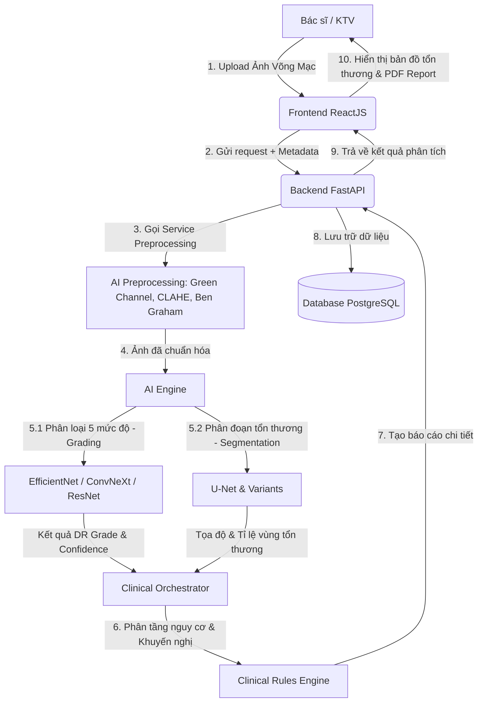

# Hệ Thống Hỗ Trợ Chẩn Đoán Bệnh Võng Mạc Tiểu Đường Từ Ảnh Võng Mạc Ứng Dụng Học Sâu
> **Diabetic Retinopathy Screening & Diagnostic Support System (DR-Screening)**
>
> Đề tài nghiên cứu và xây dựng ứng dụng hỗ trợ bác sĩ nhãn khoa trong việc phát hiện sớm, phân loại 5 mức độ bệnh lý võng mạc tiểu đường (DR) và phân đoạn chi tiết các vùng tổn thương (Microaneurysm, Hemorrhage, Hard Exudate) từ ảnh chụp đáy mắt (Fundus Image).

---

## 📸 Tổng Quan Luồng Xử Lý Hệ Thống

Hệ thống hoạt động theo một luồng tương tác khép kín giữa Bác sĩ, Backend và các mô hình Học Sâu (Deep Learning):



---

## 📂 Cấu Trúc Thư Mục Dự Án

Dự án được tổ chức thành các phân hệ độc lập, giúp các thành viên phát triển song song mà không bị xung đột mã nguồn:

```
dr-diagnostic-system/
├── ai/                     # Phân hệ AI (Thành viên 1 & 2)
│   ├── preprocessing/      # Tiền xử lý ảnh (Green channel, CLAHE, Ben Graham)
│   ├── grading/            # Model phân loại DR 5 mức độ (EfficientNet, ResNet, ConvNeXt)
│   ├── segmentation/       # Model phân đoạn tổn thương (U-Net, Attention U-Net)
│   └── semi_supervised/    # Nghiên cứu Semi-supervised & Few-shot Learning
├── backend/                # Server FastAPI & Tích hợp (Thành viên 3)
│   ├── app/
│   │   ├── api/            # API Endpoints (patients, screenings, statistics, auth)
│   │   ├── core/           # Cấu hình hệ thống, bảo mật, kết nối DB
│   │   ├── models/         # Khai báo cấu trúc bảng cơ sở dữ liệu SQLAlchemy
│   │   ├── schemas/        # Định nghĩa Pydantic validation cho request/response
│   │   └── services/       # Xử lý logic lâm sàng, xuất PDF, gọi mô hình AI
│   └── main.py             # Điểm khởi chạy API Server
├── frontend/               # Giao diện Web ứng dụng ReactJS (Thành viên 3)
│   ├── src/
│   │   ├── components/     # UI components dùng chung (Buttons, Cards, Modals)
│   │   ├── screens/        # Các màn hình chính (Phòng khám, Quản lý bệnh nhân, Thống kê)
│   │   ├── services/       # Client gọi APIs từ Backend
│   │   └── theme/          # Bảng màu thiết kế tập trung (Premium HSL CSS)
│   └── package.json
├── database/               # Cơ sở dữ liệu PostgreSQL
│   └── init.sql            # Script khởi tạo cấu trúc bảng & dữ liệu mẫu ban đầu
├── docs/                   # Tài liệu hướng dẫn & Đặc tả dự án
│   ├── api_contract.md     # Đặc tả API Json trao đổi giữa các thành viên
│   ├── clinical_guidelines.md # Thang điểm ICDR/ETDRS & Tiêu chuẩn lâm sàng Việt Nam
│   └── image_standards.md  # Hướng dẫn chụp ảnh võng mạc & tiêu chuẩn chất lượng ảnh
├── docker-compose.yml      # Cấu hình container chạy nhanh PostgreSQL & Services
└── README.md               # Tài liệu tổng quan (File này)
```

---

## 👥 Phân Chia Nhiệm Vụ Trong Nhóm

| Thành Viên | Vai Trò Chính | Nhiệm Vụ Chi Tiết |
| :--- | :--- | :--- |
| **Thành viên 1** | **AI Engineer (Grading)** | - Nghiên cứu tiền xử lý ảnh võng mạc (Green Channel, CLAHE, Ben Graham).<br>- Huấn luyện & tối ưu mô hình phân loại DR 5 mức độ (ETDRS/ICDR) sử dụng EfficientNet, ResNet, ConvNeXt.<br>- Đánh giá mô hình bằng chỉ số Quadratic Weighted Kappa. |
| **Thành viên 2** | **AI Engineer (Segmentation)** | - Xây dựng mô hình phân đoạn tổn thương (Microaneurysm, Hemorrhage, Hard Exudate) bằng U-Net và các biến thể.<br>- Đánh giá bằng Dice Score.<br>- Nghiên cứu Semi-supervised & Few-shot Learning để tối ưu hóa kho ảnh ít nhãn. |
| **Thành viên 3** | **Fullstack & Integrator** | - Phân tích thiết kế hệ thống, thiết kế Database PostgreSQL.<br>- Xây dựng Backend FastAPI kết nối DB, quản lý thông tin bệnh nhân, lịch hẹn, thống kê dịch tễ.<br>- Viết Module báo cáo tự động, xuất PDF kết quả khám bệnh.<br>- Xây dựng Frontend ReactJS (Giao diện bác sĩ, quản trị viên, Dashboard báo cáo). |

---

## 🚀 Hướng Dẫn Cài Đặt Và Chạy Nhanh

### Yêu Cầu Hệ Thống
* Python 3.9+
* Node.js 18+
* PostgreSQL 14+ hoặc Docker Desktop

### 1. Khởi chạy Database nhanh bằng Docker
Tại thư mục gốc dự án, chạy lệnh:
```bash
docker-compose up -d db
```
Hệ thống sẽ khởi tạo một container PostgreSQL lắng nghe ở cổng `5432`, tự động import cấu trúc bảng từ `database/init.sql`.

### 2. Cài đặt và chạy Backend (FastAPI)
```bash
cd backend
python -m venv .venv
# Windows:
.venv\Scripts\activate
# Linux/macOS:
source .venv/bin/activate

pip install -r requirements.txt
cp .env.example .env
uvicorn main:app --reload --port 8000
```
API Swagger Docs sẽ khả dụng tại: http://localhost:8000/docs

### 3. Cài đặt và chạy Frontend (ReactJS)
```bash
cd frontend
npm install
npm run dev
```
Giao diện Web sẽ chạy tại: http://localhost:5173

---

## 🛠️ Quy Trình Làm Việc Với Git (Git Workflow)

Để tránh xung đột code, tất cả thành viên bắt buộc tuân thủ quy tắc sau:

1. **Nhánh chính (develop & main):** Không commit trực tiếp lên `main` hay `develop`.
2. **Tạo nhánh mới:** Khi làm nhiệm vụ nào, tạo nhánh từ `develop`:
   * Tính năng mới: `feat/ten-tinh-nang` (Ví dụ: `feat/preprocessing-clahe`)
   * Sửa lỗi: `fix/ten-bug` (Ví dụ: `fix/db-connection-retry`)
3. **Commit:** Tuân thủ chuẩn Conventional Commits:
   * `feat(ai): add clahe preprocessing to dataset loader`
   * `fix(backend): correct database timezone response`
   * `docs: update api contract for grading output`
4. **Merge Request (MR):** Sau khi làm xong, push lên remote và tạo Merge Request trên GitHub để review trước khi merge vào `develop`.

---

## 📜 Tiêu Chuẩn Lâm Sàng Áp Dụng (ICDR)

Hệ thống phân loại ảnh chụp võng mạc thành 5 mức độ bệnh lý theo thang điểm chuẩn lâm sàng quốc tế ICDR (International Clinical Diabetic Retinopathy):

1. **No DR (Cấp 0):** Võng mạc bình thường, không xuất hiện tổn thương.
2. **Mild NPDR (Cấp 1):** Chỉ có các vi phình mạch (Microaneurysms).
3. **Moderate NPDR (Cấp 2):** Có vi phình mạch, xuất huyết (Hemorrhages), rỉ dịch (Exudates) nhưng chưa đến mức Severe.
4. **Severe NPDR (Cấp 3):** Xuất huyết nặng (>20 điểm ở cả 4 cung phần tư), tĩnh mạch dạng chuỗi (Beading) ở >= 2 cung phần tư, hoặc IRMA ở >= 1 cung phần tư.
5. **Proliferative DR (Cấp 4):** Tân mạch hóa võng mạc (Neovascularization) hoặc xuất huyết dịch kính/trước võng mạc.
