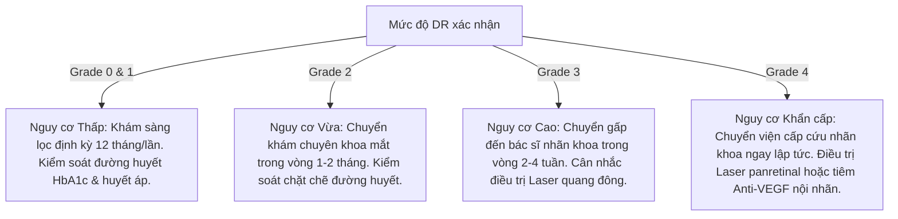

# Tiêu Chuẩn Lâm Sàng Và Hướng Dẫn Điều Trị Bệnh Võng Mạc Tiểu Đường

Tài liệu này tổng hợp các tiêu chuẩn lâm sàng quốc tế và các quy định của Bộ Y tế Việt Nam liên quan đến việc chẩn đoán, sàng lọc bệnh võng mạc tiểu đường (Diabetic Retinopathy - DR) bằng trí tuệ nhân tạo.

---

## 1. Phân Loại Mức Độ Bệnh Lý Võng Mạc Tiểu Đường (DR Grading)

Hệ thống áp dụng thang phân loại quốc tế **ICDR (International Clinical Diabetic Retinopathy)** do Hội Nhãn khoa Hoa Kỳ (AAO) đề xuất, phân chia thành 5 mức độ nghiêm trọng dựa trên các dấu hiệu tổn thương quan sát được trên ảnh đáy mắt:

| Cấp Độ | Tên Lâm Sàng (ICDR) | Dấu Hiệu Đặc Trưng Trên Ảnh Võng Mạc (Fundus Image) | Phân Tầng Nguy Cơ |
| :---: | :--- | :--- | :---: |
| **0** | **No DR** (Không có bệnh lý) | Không xuất hiện bất kỳ tổn thương nào trên võng mạc. | **Thấp (Low)** |
| **1** | **Mild NPDR** (NPDR mức độ nhẹ) | Chỉ xuất hiện các **vi phình mạch (Microaneurysms - MA)** dạng nốt đỏ nhỏ tròn, biên giới rõ. | **Thấp (Low)** |
| **2** | **Moderate NPDR** (NPDR mức độ vừa) | Xuất hiện vi phình mạch kèm theo **xuất huyết võng mạc (Hemorrhages)**, **rỉ dịch cứng (Hard Exudates)** hoặc **rỉ dịch mềm (Soft Exudates / Cotton Wool Spots)** nhưng ít hơn mức độ nặng. | **Trung bình (Medium)** |
| **3** | **Severe NPDR** (NPDR mức độ nặng) | Thỏa mãn quy tắc **4-2-1** (chỉ cần đạt 1 trong 3 tiêu chí): - Xuất huyết võng mạc nặng (>20 điểm xuất huyết) ở cả 4 cung phần tư. - Tĩnh mạch dạng chuỗi hạt (Venous Beading) rõ rệt ở >= 2 cung phần tư. - Bất thường vi mạch nội võng mạc (IRMA) rõ rệt ở >= 1 cung phần tư. | **Cao (High)** |
| **4** | **Proliferative DR (PDR)** (DR tăng sinh) | Có một hoặc cả hai dấu hiệu sau: - **Tân mạch hóa (Neovascularization):** Sự xuất hiện của các mạch máu mới bất thường ở đĩa thị hoặc các vùng khác trên võng mạc. - **Xuất huyết dịch kính** hoặc xuất huyết trước võng mạc. | **Khẩn cấp (Urgent)** |

---

## 2. Quy Trình Khuyến Nghị Lâm Sàng (Clinical Recommendation Engine)

Dựa trên kết quả phân loại mức độ DR được bác sĩ xác nhận, hệ thống tự động đưa ra khuyến nghị theo dõi và điều trị theo Hướng dẫn chẩn đoán và điều trị bệnh võng mạc đái tháo đường của Bộ Y tế Việt Nam:

---

## 3. Quy Định Và Tiêu Chuẩn Pháp Lý Về AI Y Tế Tại Việt Nam

Việc triển khai các mô hình trí tuệ nhân tạo hỗ trợ chẩn đoán hình ảnh y khoa tại Việt Nam cần tuân thủ các văn bản pháp luật và quy định lâm sàng hiện hành:

1. **Luật Khám bệnh, chữa bệnh 2023:** Quy định về việc ứng dụng công nghệ thông tin và thiết bị y tế công nghệ cao trong khám chữa bệnh. Các hệ thống AI đóng vai trò là **Công cụ hỗ trợ chẩn đoán (Decision Support Software)**, quyết định cuối cùng vẫn thuộc về bác sĩ có chứng chỉ hành nghề phù hợp.
2. **Nghị định 98/2021/NĐ-CP (Quản lý trang thiết bị y tế):** Phần mềm AI chẩn đoán hình ảnh phân tích trực tiếp ảnh y tế (như ảnh võng mạc) được phân loại là **Trang thiết bị y tế Loại B hoặc C** (Software as a Medical Device - SaMD). Cần được cấp phép lưu hành bởi Bộ Y tế trước khi đưa vào ứng dụng lâm sàng chính thức.
3. **Quy chuẩn bảo mật thông tin bệnh nhân (GDPR / Nghị định 13/2023/NĐ-CP về Bảo vệ dữ liệu cá nhân):**
   - Ảnh chụp võng mạc và thông tin bệnh án là dữ liệu cá nhân nhạy cảm.
   - Mọi hình ảnh trước khi truyền lên AI Engine để xử lý cần được **xóa bỏ thông tin định danh (De-identification / Anonymization)** gồm họ tên, mã bệnh nhân trên file ảnh gốc để bảo mật tối đa.
   - Dữ liệu lưu trữ trong PostgreSQL cần được mã hóa đường truyền (SSL/TLS) và phân quyền truy cập nghiêm ngặt.
