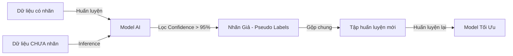

# Nghiên Cứu Kỹ Thuật Học Bán Giám Sát (Semi-supervised) Và Học Ít Nhãn (Few-shot)

Tài liệu này tổng hợp cơ sở lý thuyết và hướng dẫn thực hành nghiên cứu AI nâng cao cho **Thành viên 3** nhằm giải quyết bài toán tận dụng nguồn dữ liệu ảnh võng mạc chưa được gán nhãn lớn trong thực tế lâm sàng tại Việt Nam.

---

## 1. Bài Toán Học Bán Giám Sát (Semi-supervised Learning)

 Trong thực tế lâm sàng tại các bệnh viện Việt Nam, việc thu thập ảnh võng mạc (đáy mắt) rất dễ dàng, nhưng quy trình gán nhãn (Grading & Segmentation) đòi hỏi các bác sĩ nhãn khoa giàu kinh nghiệm tốn nhiều thời gian và công sức. 
*   **Dữ liệu có nhãn ($D_L$):** Rất ít (chỉ vài trăm đến vài nghìn ảnh từ EyePACS, APTOS, IDRiD).
*   **Dữ liệu chưa có nhãn ($D_U$):** Rất lớn (hàng chục nghìn ảnh chụp từ máy đáy mắt lâm sàng chưa qua duyệt).

### Các Thuật Toán Khuyến Nghị Cho Nhóm

#### A. Pseudo-Labeling (Tự gán nhãn giả)
1. Huấn luyện mô hình cơ sở $M$ trên tập dữ liệu có nhãn $D_L$.
2. Sử dụng mô hình $M$ dự đoán nhãn cho tập dữ liệu chưa gán nhãn $D_U$.
3. Lọc các ảnh có độ tin cậy dự đoán cao (Confidence > 0.95), đưa chúng vào tập huấn luyện mới với nhãn giả (Pseudo-labels).
4. Huấn luyện lại mô hình trên tập dữ liệu gộp.

#### B. FixMatch (Consistency Regularization + Pseudo-Labeling)
Một phương pháp semi-supervised phổ biến cần được so sánh thực nghiệm với supervised baseline:
1. Áp dụng tăng cường dữ liệu nhẹ (Weak Augmentation - e.g., lật ảnh, dịch chuyển nhẹ) lên ảnh chưa gán nhãn $u$. Mô hình dự đoán nhãn giả $p$.
2. Áp dụng tăng cường dữ liệu mạnh (Strong Augmentation - e.g., RandAugment, CLAHE cường độ cao) lên cùng ảnh $u$.
3. Tối ưu hóa mô hình sao cho dự đoán trên ảnh tăng cường mạnh trùng khớp với nhãn giả $p$ thu được từ ảnh tăng cường nhẹ (nếu độ tin cậy vượt ngưỡng $0.95$).

---

## 2. Bài Toán Học Với Dữ Liệu Ít Nhãn (Few-shot Learning)

Few-shot Learning (FSL) được áp dụng khi hệ thống cần chẩn đoán các tổn thương vi mô hiếm gặp trên võng mạc hoặc học nhanh từ một vài mẫu ca bệnh đặc biệt (1-shot hoặc 5-shot).

### Mạng Nguyên Mẫu (Prototypical Networks - ProtoNet)
ProtoNet là một kiến trúc FSL dựa trên không gian nhúng (metric-based learning):
1. Sử dụng một mạng CNN (như ResNet hoặc EfficientNet làm Backbone) để chiếu ảnh võng mạc vào một không gian đặc trưng nhiều chiều.
2. Tính toán điểm trung tâm (Prototype $c_k$) cho mỗi lớp bệnh lý bằng cách lấy trung bình cộng các vector đặc trưng của các ảnh có nhãn trong tập hỗ trợ (Support Set).
3. Với một ảnh truy vấn mới (Query Image), tính khoảng cách Euclide từ vector đặc trưng của nó đến các Prototype $c_k$. Phân loại ảnh vào lớp có khoảng cách gần nhất.

---

## 3. Cấu Trúc Khung Thực Hành Trong Thư Mục `ai/`

Để hỗ trợ thực hành, Thành viên 3 sẽ làm việc chính tại thư mục `ai/semi_supervised/` với các file đã được tạo khung sẵn:

1. `ai/semi_supervised/semi_supervised_training.py`: nạp best checkpoint RETFound,
   tạo pseudo-label từ ảnh ngoài và chọn model bằng validation QWK.
2. `ai/semi_supervised/few_shot_demo.py`: ProtoNet episodic trên ảnh thật, dùng
   RETFound làm encoder; train episode từ `train` và validation episode từ `val`.
3. `ai/semi_supervised/Semi_Supervised_Few_Shot_Colab.ipynb`: chọn checkpoint và
   nguồn dữ liệu trên Google Drive, sau đó chạy một trong hai phương pháp.
4. `ai/semi_supervised/README.md`: cấu trúc dữ liệu, giới hạn và điều kiện an toàn.

Hai pipeline không tự đánh giá `test`. Kết quả vẫn là artifact nghiên cứu cho đến
khi phương pháp được khóa bằng validation và trải qua đánh giá test độc lập.
