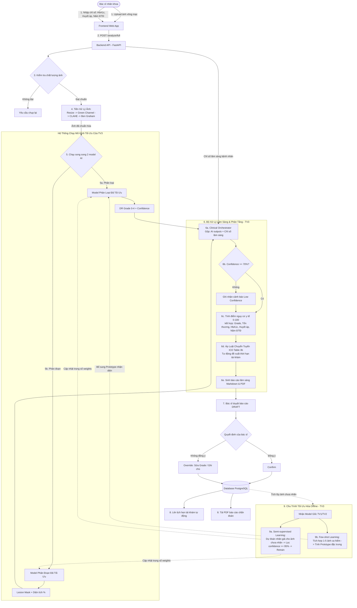

# Luồng Xử Lý Chẩn Đoán Bệnh Võng Mạc Tiểu Đường - Toàn Hệ Thống

Tài liệu mô tả chi tiết luồng xử lý hoàn chỉnh từ giai đoạn bàn giao mô hình AI cho đến luồng chẩn đoán lâm sàng tích hợp thực tế.

---

## 1. Sơ Đồ Khái Niệm Quan Hệ Thành Viên

```
[TV1: Model Phân Loại Gốc] ───(Bàn giao file .pth)───► [ TV3: AI NÂNG CAO & HỖ TRỢ LÂM SÀNG ]
[TV2: Model Phân Đoạn Gốc] ───(Bàn giao file .pth)───►          │
                                                               │ (Tối ưu hóa Offline bằng
                                                               │  Semi-supervised & Few-shot)
                                                               ▼
                                                      [ TV3: Hệ Thống Chẩn Đoán Tích Hợp ]
                                                       - Model phân loại tối ưu
                                                       - Model phân đoạn tối ưu
                                                       - Quy tắc lâm sàng (Clinical Rules)
                                                       - Công thức phân tầng nguy cơ
```

---

## 2. Sơ Đồ Luồng Xử Lý Toàn Hệ Thống

Sơ đồ Mermaid dưới đây mô tả chi tiết luồng Online (chẩn đoán cho bệnh nhân) kết hợp với luồng Offline (tích lũy dữ liệu và tối ưu hóa mô hình do TV3 quản lý).



---

## 3. Mô Tả Chi Tiết Luồng Chẩn Đoán Tích Hợp

### Bước 1: Thu Thập Thông Tin
Bác sĩ nhãn khoa tải lên ảnh võng mạc của bệnh nhân và nhập các thông tin lâm sàng bao gồm:
- **HbA1c (%):** Đánh giá khả năng kiểm soát đường huyết của bệnh nhân đái tháo đường.
- **Huyết áp (mmHg):** Huyết áp cao làm tăng nguy cơ tổn thương mạch máu võng mạc.
- **Số năm bị đái tháo đường:** Thời gian mắc bệnh càng lâu, nguy cơ xuất hiện biến chứng võng mạc càng cao.

### Bước 2: Quality Gate & Tiền Xử Lý Ảnh
- Hệ thống kiểm tra kỹ thuật của file ảnh (Quality Gate) để loại bỏ ảnh hỏng.
- Thực hiện tiền xử lý chuẩn y khoa: Resize $\rightarrow$ Green Channel Extraction (làm nổi bật mạch máu) $\rightarrow$ CLAHE (cân bằng tương phản cục bộ) $\rightarrow$ Ben Graham Normalization (khử nhiễu nền).

### Bước 3: Inference Bằng Các Model Đã Tối Ưu (TV3 vận hành)
Hệ thống sử dụng các mô hình học sâu **đã được tối ưu hóa** bởi TV3 để nhận diện ảnh:
1. **Model phân loại (TV1 gốc đã tối ưu):** Dự đoán cấp độ DR Grade từ 0 đến 4 cùng độ tin cậy (Confidence).
2. **Model phân đoạn (TV2 gốc đã tối ưu):** Định vị các vùng tổn thương (Microaneurysm, Hemorrhage, Hard Exudate) và tính tỷ lệ diện tích tổn thương trên ảnh.

### Bước 4: Hỗ Trợ Lâm Sàng & Phân Tầng Nguy Cơ (TV3 thực hiện)
Clinical Orchestrator thu thập dữ liệu từ AI và bệnh án để chạy thuật toán y học:
- **Kiểm tra độ tin cậy:** Nếu `confidence` < 70%, hệ thống gắn cờ cảnh báo để bác sĩ cẩn trọng khi duyệt.
- **Tính điểm nguy cơ lâm sàng (0-100):** Tích hợp thông tin DR Grade, diện tích tổn thương cùng các yếu tố nguy cơ hệ thống (HbA1c cao, huyết áp cao, số năm bị bệnh lâu).
- **Quyết định thời gian chuyển tuyến & tái khám:** Áp dụng luật lâm sàng theo **ICO 2017 Table 3b**:
  - *Grade 0-1 (Risk thấp):* Tái khám sau 12-24 tháng.
  - *Grade 2 (NPDR Moderate):* Tái khám sau 6-12 tháng.
  - *Grade 3 (NPDR Severe):* Yêu cầu chuyển tuyến nhãn khoa trong vòng 1 tháng.
  - *Grade 4 (PDR):* Yêu cầu chuyển tuyến khẩn cấp trong vòng 24-48 giờ do có nguy cơ mù lòa cấp tính.
  - *Nghi ngờ DME (Phù hoàng điểm):* Yêu cầu chuyển tuyến khẩn cấp điều trị Anti-VEGF hoặc laser.
- **Sinh báo cáo:** Tạo báo cáo tóm tắt Markdown và xuất PDF nhúng kèm ảnh võng mạc minh chứng.

### Bước 5: Duyệt Kết Quả & Database
- Bác sĩ xem báo cáo nháp (Draft) trên Web.
- Bác sĩ có quyền phê duyệt kết quả AI (Confirm) hoặc thay đổi mức độ chẩn đoán theo kinh nghiệm lâm sàng cá nhân (Override).
- Dữ liệu được lưu trữ chính thức vào PostgreSQL để tự động đặt lịch nhắc hẹn tái khám cho bệnh nhân.

### Bước 6: Vòng Lặp Tối Ưu Hóa Offline (TV3 thực hiện)
Kho ảnh tích lũy qua thời gian trong Database được sử dụng để tối ưu hóa model:
- **Semi-supervised:** Sử dụng mô hình hiện hành để gán nhãn giả (Pseudo-Labeling) cho ảnh chưa nhãn đạt độ tin cậy $\ge 95\%$, sau đó chạy retrain offline để cải tiến mô hình.
- **Few-shot:** Khi bác sĩ chẩn đoán và gắn nhãn cho 1-5 ảnh ca bệnh hiếm gặp, ProtoNet sẽ tính toán Prototype đại diện để mô hình có khả năng nhận diện lớp bệnh mới ngay lập tức.
- Trọng số model mới tốt hơn sẽ được deploy để thay thế mô hình cũ đang chạy online.

---

## 4. Bảng Phân Chia Vai Trò Trong Dự Án

| | Thành Viên 1 | Thành Viên 2 | Thành Viên 3 (Tích hợp & AI nâng cao) |
|---|---|---|---|
| **Công việc chính** | Xây dựng mô hình phân loại DR Grade | Xây dựng mô hình phân đoạn tổn thương | Tối ưu hóa mô hình + Phát triển hệ thống luật chẩn đoán y khoa |
| **Bàn giao** | File model gốc (`.pth`) + API phân loại cơ bản | File model gốc (`.pth`) + API phân đoạn cơ bản | Vận hành toàn bộ pipeline chẩn đoán (Inference, Rules, PDF, DB, Web) |
| **Thuật toán AI áp dụng** | Supervised Learning (EfficientNet, ResNet, ConvNeXt) | Supervised Learning (U-Net, Attention U-Net) | Semi-supervised Learning (Pseudo-labeling) + Few-shot Learning (ProtoNet) |
